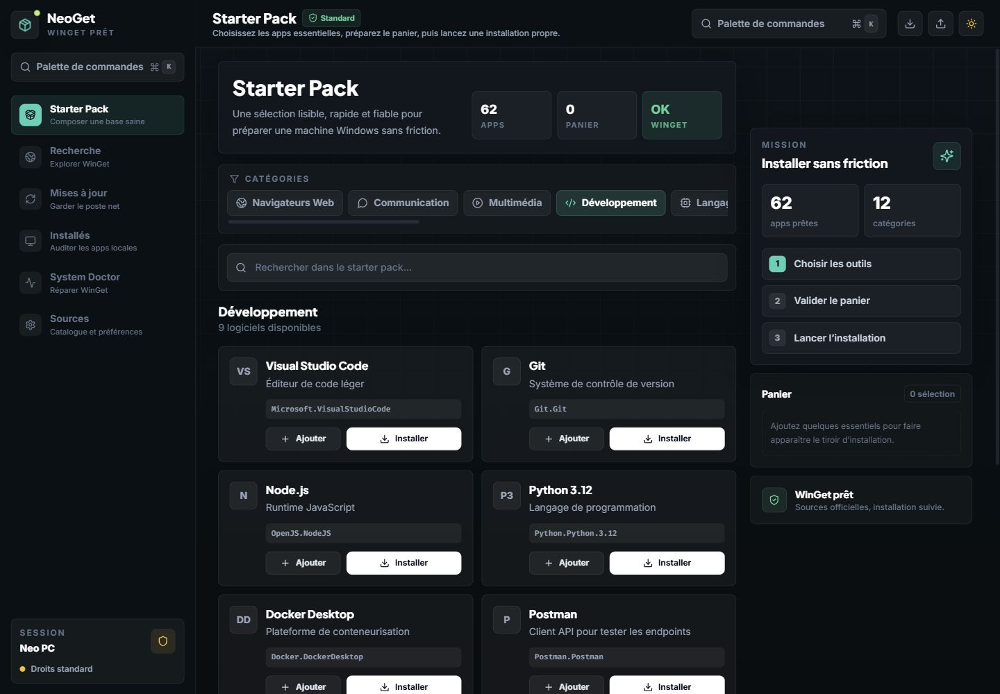

<div align="center">

# NeoGet

**Le cockpit Windows moderne pour installer, mettre à jour et nettoyer vos logiciels avec WinGet.**

NeoGet transforme une installation Windows fraîche en poste prêt à travailler : catalogue guidé, recherche WinGet, panier d'installation, mises à jour, désinstallation, diagnostic système et paramètres d'équipe dans une interface desktop premium.




</div>

## Ce que fait NeoGet

NeoGet est une application desktop Tauri pour piloter WinGet sans terminal. L'objectif est simple : gagner du temps quand vous préparez, maintenez ou nettoyez une machine Windows.

| Besoin | Réponse NeoGet |
| --- | --- |
| Préparer un nouveau PC | Starter Pack par catégories avec installation rapide |
| Trouver un logiciel | Recherche globale dans les dépôts WinGet |
| Installer plusieurs apps | Panier flottant + file d'installation suivie |
| Garder le poste à jour | Centre de mises à jour basé sur `winget upgrade` |
| Nettoyer une machine | Inventaire des apps installées + désinstallation |
| Diagnostiquer WinGet | System Doctor, sources, droits admin, ressources système |
| Réutiliser une config | Import/export de listes d'applications |

## Expérience

L'interface a été pensée comme une app produit moderne plutôt qu'un dashboard utilitaire :

- app shell sombre, lisible et chaleureux ;
- navigation latérale claire ;
- palette de commandes avec recherche rapide ;
- cartes logiciels compactes et scannables ;
- panier persistant pour préparer une installation groupée ;
- états vides utiles, loaders propres et notifications discrètes ;
- responsive pour inspection en fenêtre réduite ;
- dark mode premium par défaut.

## Télécharger / lancer

L'exécutable compilé se trouve ici :

```powershell
.\releases\neoget.exe
```

WinGet doit être disponible sur la machine cible. Si l'installation ou la recherche ne répond pas correctement, ouvrez **System Doctor** pour vérifier les sources, les droits et l'état local.

## Développement

### Prérequis

- Windows 10/11
- Node.js récent
- Rust + Cargo
- Tauri CLI via les dépendances du projet
- WinGet installé pour tester les workflows système

### Installer les dépendances

```powershell
npm install
```

### Lancer l'app desktop

```powershell
npm run tauri:dev
```

### Lancer seulement le frontend

```powershell
npm run dev
```

## Compiler l'exécutable

Build complet Tauri :

```powershell
npm run tauri:build
```

Tauri génère le binaire release dans le dossier Cargo. Pour publier dans le projet, copiez-le dans `releases` :

```powershell
Copy-Item `
  "$env:USERPROFILE\.cargo\target\neoget\release\neoget.exe" `
  ".\releases\neoget.exe" `
  -Force
```

Le fichier attendu est :

```text
releases/neoget.exe
```

## Scripts

| Commande | Description |
| --- | --- |
| `npm run dev` | Lance le frontend Vite |
| `npm run build` | Compile TypeScript et le bundle web |
| `npm run tauri:dev` | Lance NeoGet en mode desktop développement |
| `npm run tauri:nowatch` | Lance Tauri sans watcher |
| `npm run tauri:build` | Compile l'application desktop optimisée |
| `npm run launch` | Build frontend puis lance Tauri sans watcher |

## Architecture

```text
NeoGet/
├── src/
│   ├── App.tsx                 Shell, navigation et workflows globaux
│   ├── components/             Vues produit, panier, palette, toasts
│   ├── hooks/                  Thème, panier, installation, statut système
│   ├── index.css               Design system Tailwind
│   └── types.ts                Contrats UI
├── src-tauri/
│   ├── src/commands.rs         Commandes WinGet, parsing, diagnostic
│   ├── src/lib.rs              Enregistrement Tauri
│   └── tauri.conf.json         Configuration desktop
├── docs/
│   └── assets/neoget-app.png   Capture utilisée par ce README
├── releases/
│   └── neoget.exe              Exécutable prêt à lancer
├── software.json               Catalogue Starter Pack
└── package.json                Scripts frontend et Tauri
```

## Stack

| Couche | Technologie |
| --- | --- |
| Interface | React 19, TypeScript, Tailwind CSS, Framer Motion |
| Desktop | Tauri 2 |
| Système | Rust, Tokio, commandes WinGet |
| Build | Vite, Cargo |
| Catalogue | `software.json` + catalogues externes JSON |

## Sécurité et robustesse

NeoGet garde les actions système côté Tauri :

- les commandes WinGet sont appelées depuis Rust ;
- les installations concurrentes sont bloquées ;
- les commandes longues ont des timeouts ;
- les erreurs de privilèges sont reformulées ;
- PowerShell est forcé en sortie UTF-8 pour éviter les caractères cassés ;
- les sorties WinGet localisées sont parsées avec tolérance.

## Documentation

- [Architecture](docs/ARCHITECTURE.md)
- [Installation développeur](docs/SETUP.md)
- [Design system](docs/DESIGN_SYSTEM.md)
- [Changelog](docs/CHANGELOG.md)

## Roadmap

- Historique local des installations et désinstallations.
- Profils réutilisables pour plusieurs types de machines.
- Export enrichi avec versions, sources et statut.
- Meilleure édition du catalogue personnalisé.
- Packaging installable et signature de l'exécutable.

## Licence

MIT

---

Construit avec React, Rust, Tauri et une obsession très raisonnable pour les installations propres.
